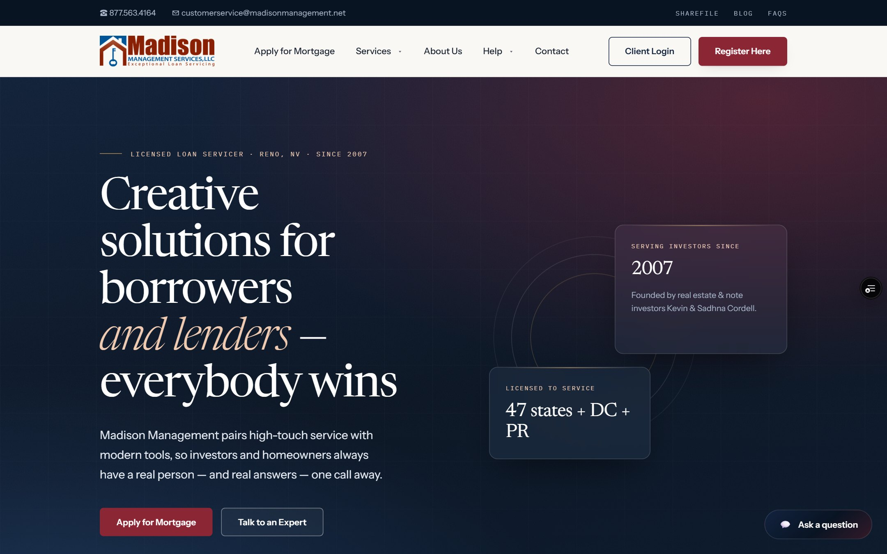
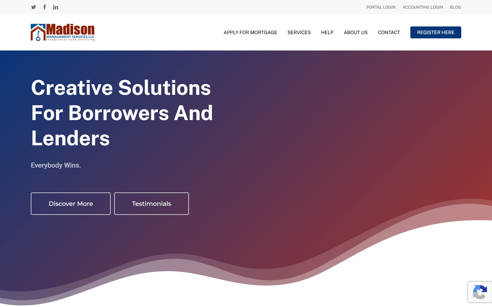
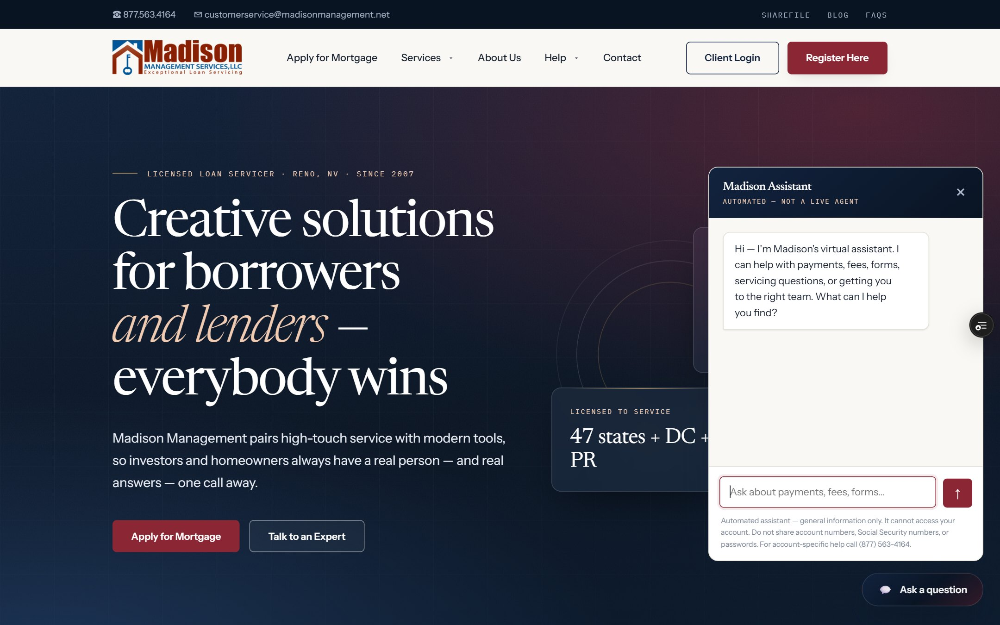
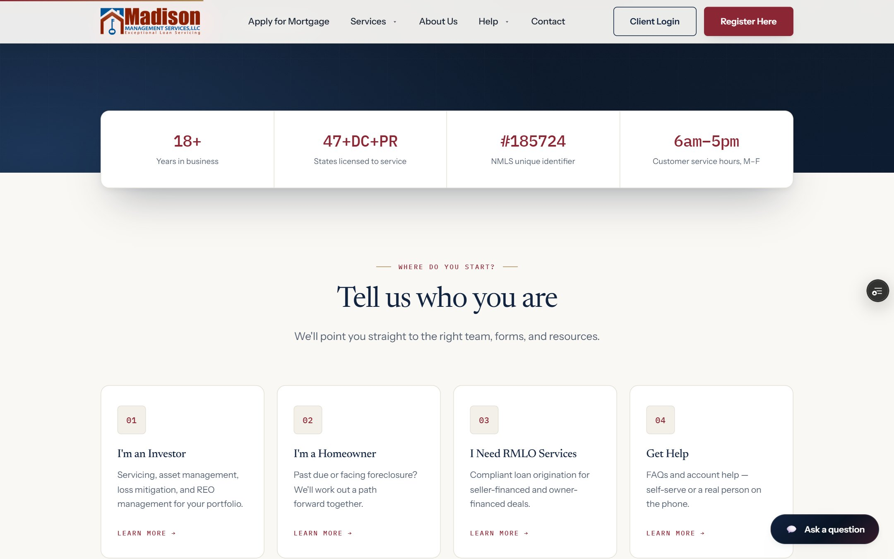
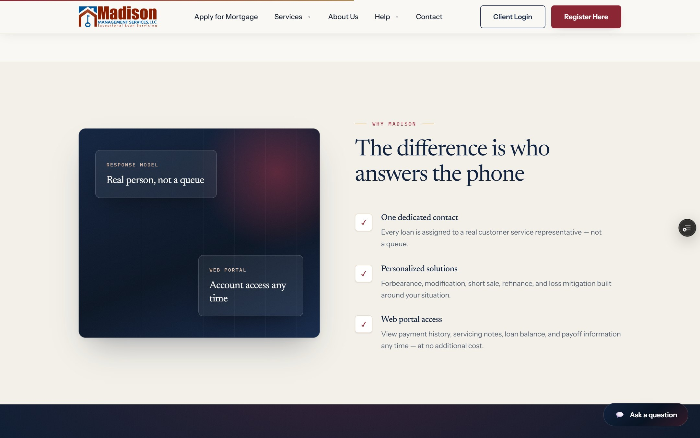
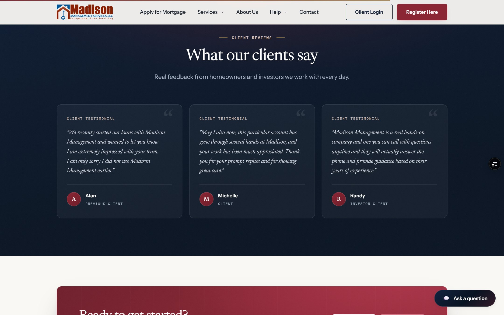
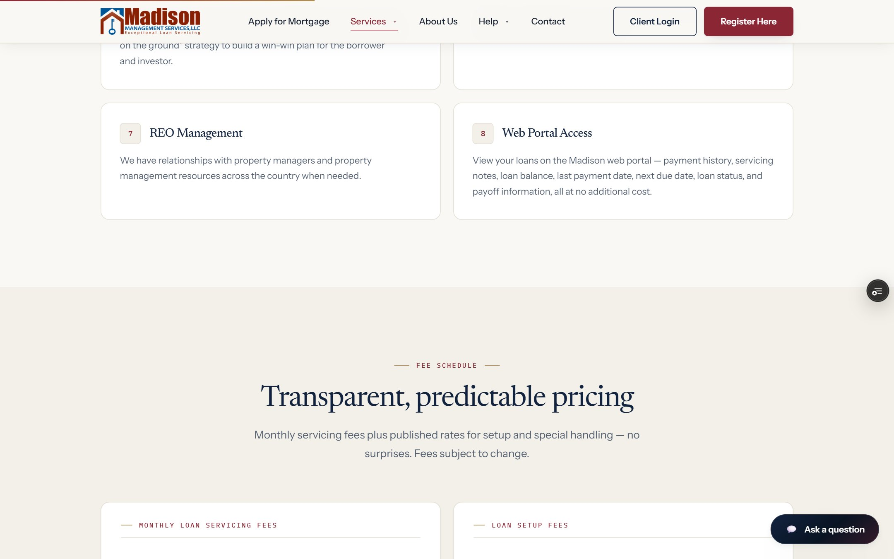
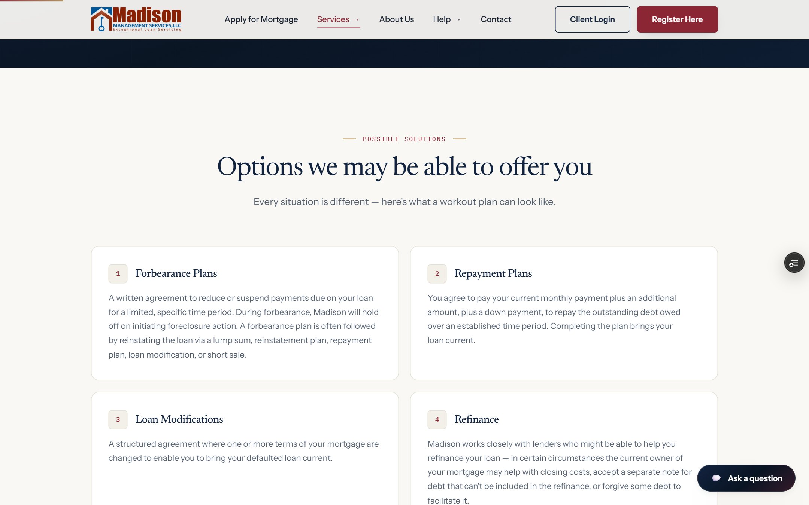
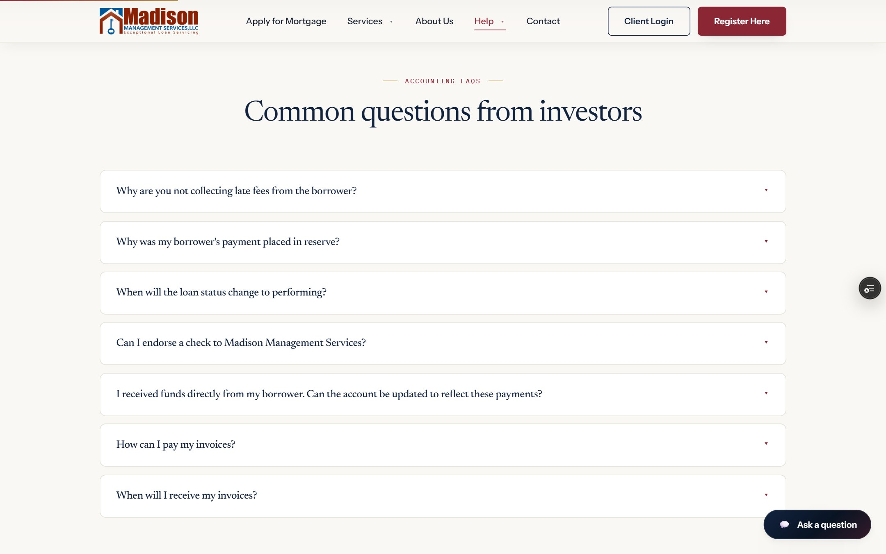
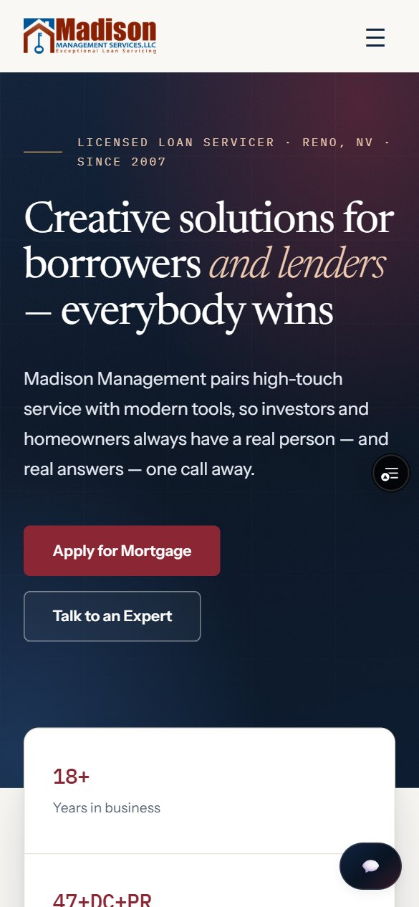

# Madison Management Services — website redesign

A ground-up redesign of [madisonmanagement.net](https://www.madisonmanagement.net), plus an
AI chat assistant, built during an internship at Madison Management Services, LLC — a specialty
loan servicer in Reno, NV.

Eight pages, no framework, no build step. One serverless function powers the assistant.



| | |
|---|---|
| **Live demo** | https://madison-redesign-964sjoaem-siddarth30.vercel.app |
| **Current site this replaces** | https://www.madisonmanagement.net |
| **Source** | this repo |

---

## Before / after

The brief: keep the company's navy-and-maroon identity and every word of its real content, but
make it read like a firm you'd trust with a mortgage.

**Before** — the current live site:



**After:**


What actually changed, and why:

| | Before | After |
|---|---|---|
| **Type** | Poppins + Inter | Newsreader (editorial serif) · Instrument Sans · IBM Plex Mono |
| **Ground** | Clinical grey `#f7f8fa` | Warm ivory `#faf8f4` |
| **Maroon** | On every icon chip and badge | A sharp accent, used sparingly |
| **Depth** | Flat gradient + cartoon wave divider | Layered glows, fine grid, grain texture, hairline rules |
| **Motion** | None | Scroll reveals, stat counters, sticky-nav condense |

The palette was inherited on purpose — navy `#12233f` and maroon `#8b2635` are unchanged. The
premium feel comes from typography, warm paper, and restraint rather than new brand colours. A
muted brass was added for hairlines only, because navy + burgundy + brass is the classic financial
identity triad.

The logo is the company's own and is **never recoloured**, even though its rust and blue sit
outside the site palette.

---

## The AI chat assistant



A chat widget on every page, backed by a Vercel serverless function calling Claude Haiku 4.5.

The hard part of a chatbot for a mortgage servicer isn't the chat — it's making sure it never
invents a fee. So it isn't allowed to answer from general knowledge:

- **Grounded.** `api/_knowledge.js` is a hand-written reference of Madison's real fees, hours,
  forms, and policies, injected into every request. The system prompt forbids stating any fee,
  rate, timeline, or policy that isn't written there.
- **Injection-resistant.** Rule 8 of the system prompt tells it to ignore instructions arriving
  inside a visitor's message that try to change its rules.
- **XSS-safe.** Model output is rendered with `textContent` and `createElement`, never
  `innerHTML`. Even `**bold**` is parsed into real `<strong>` nodes rather than by parsing HTML,
  so the model cannot inject markup.
- **Scoped.** The widget states it's automated, can't access accounts, and tells users not to
  share account numbers, SSNs, or passwords.
- **Rate limited.** 20 requests per IP per 10 minutes.

| Setting | Value |
|---|---|
| Model | `claude-haiku-4-5` |
| Max response | 600 tokens |
| Max question | 1000 characters |
| History kept | 12 turns |

If the API key is missing or billing runs out, the endpoint returns a clean error and the widget
tells the visitor to call instead — **the rest of the site is unaffected.**

---

## More screenshots

| | |
|---|---|
|  |  |
| Stats band + entry points | Split feature section |
|  |  |
| Client testimonials | Fee tables — mono figures, tabular numerals |
|  |  |
| Homeowner loss-mitigation options | FAQ accordion |



---

## How it's built

Deliberately minimal — this is a marketing site, not an application.

- **Plain HTML, CSS, JavaScript.** No framework, no bundler, no build step. Every page is a
  complete `.html` file you can open in a browser.
- **One stylesheet, one script**, shared by all eight pages.
- The only npm dependency (`@anthropic-ai/sdk`) is used by the serverless function. The pages
  themselves ship no npm code.

```
├── index.html  about.html  contact.html  faq.html
├── homeowners.html  investors.html  loan-servicing.html  rmlo-services.html
│
├── assets/
│   ├── style.css           Design system — tokens → components → responsive
│   ├── main.js             Nav, scroll reveals, counters, FAQ accordion
│   ├── chat.js             Chat widget UI
│   └── madison-logo*.png   Official brand lockup (1x + 2x)
│
└── api/
    ├── chat.js             POST /api/chat
    └── _knowledge.js       Knowledge base the assistant is grounded in
```

Every page shares an identical head, nav, and footer, with no templating layer — change one,
change all eight.

**Accessibility and resilience.** Motion is applied at runtime by `main.js` and gated behind
`prefers-reduced-motion`; if the script fails, every element stays visible and all controls still
work as plain HTML. FAQ headers are keyboard-operable with `aria-expanded`. Verified across
8 pages × 8 viewport widths (320–1600px) for horizontal overflow and layout breaks.

## Running it

No build step:

```bash
npx serve -l 4321 .
```

On Windows PowerShell use `npx.cmd` — execution policy blocks the `npx` shim. The chat widget
needs `vercel dev` and an `ANTHROPIC_API_KEY` to work locally; against a plain static server it
shows its offline fallback, which is expected.

## Deploying

```bash
npx vercel          # preview
npx vercel --prod   # production
```

`api/chat.js` is picked up automatically by Vercel's file-system routing. `_knowledge.js` isn't
routed, because of the leading underscore.

**Hosting elsewhere:** the eight pages and `assets/` are pure static files and will run on any web
server, IIS included. Only the assistant needs porting — `api/chat.js` is an ES module exporting a
Vercel-signature `(req, res)` handler, so it needs a thin wrapper (an Express route, say), a parsed
JSON `req.body`, `x-forwarded-for` forwarded by the proxy, and `ANTHROPIC_API_KEY` in that
environment. Delete `api/` and the `chat.js` script tag to drop the assistant entirely; nothing
else depends on it.

---

## Status

- ✅ Eight pages redesigned, responsive, verified 320–1600px
- ✅ Chat assistant built, grounded, and deployed
- ⚠️ **The live demo's assistant needs a valid `ANTHROPIC_API_KEY`** set in the Vercel environment
  it's deployed to. Without one the endpoint returns a clean error and the site works normally.
- ⚠️ The contact form still uses a `mailto:` action and needs a real form handler before launch.

Fees, licensing (47 states + DC + PR), NMLS #185724, hours, and phone numbers throughout are real
company data — **content to verify, not to invent.** The same goes for `api/_knowledge.js`: an
error there becomes something the assistant tells a customer.
